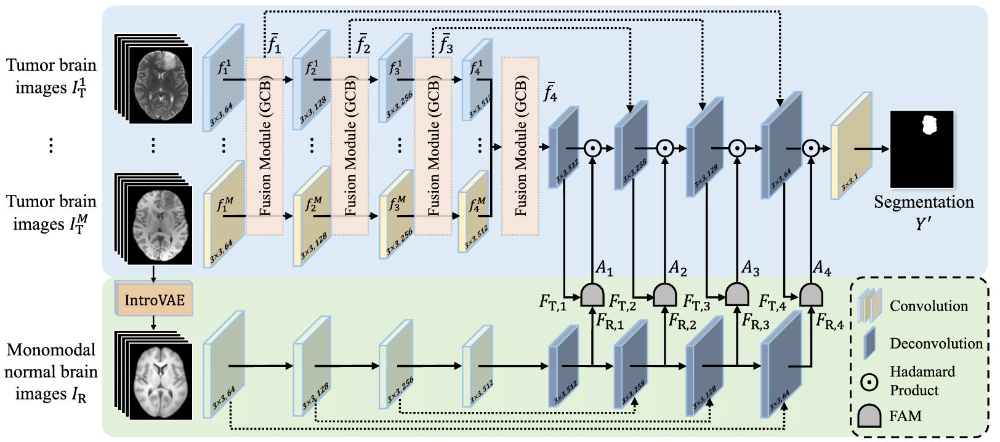

# BrainTumorSegmentation-FAM-GCB

This repository contains the implementation of our research on early brain tumor detection and segmentation. Our method integrates advanced deep learning techniques, such as the **Feature Alignment Module (FAM)** and **Global Correlation Block (GCB)**, to achieve state-of-the-art segmentation accuracy. By utilizing normal brain images as a reference, the model significantly enhances performance and robustness.

## Features

- **High Accuracy**: Achieved 99.35% segmentation accuracy using an enhanced U-Net architecture.
- **Feature Alignment Module (FAM)**: Aligns features from tumor and normal brain images to improve segmentation precision.
- **Global Correlation Block (GCB)**: Captures global correlations across multimodal data for effective feature fusion.
- **Normal Brain Reference**: Incorporates monomodal normal brain images to enhance tumor detection, inspired by radiological practices.
- **Comprehensive Evaluation**: Validated on BraTS2022 dataset.

## Architecture Overview



The model consists of:
- **Segmentation Backbone**: A modified U-Net with encoding, fusion, and decoding pathways.
- **Feature Alignment Module (FAM)**: Ensures effective comparison and alignment of features.
- **Global Correlation Block (GCB)**: Facilitates feature fusion using self-attention mechanisms.
- **Normal Appearance Network**: Generates normal brain features for alignment.

## Dataset

- **Public Dataset**: BraTS2022.
- **Public Dataset**: Normal Brain MRI Dataset.

For preprocessing, all images were converted into 2.5D slices with neighboring slices.

## Installation

1. Clone the repository:
   ```bash
   git clone https://github.com/nikhileshmeher0204/BrainTumorSegmentation-FAM-GCB.git
   cd BrainTumorSegmentation-FAM-GCB
   ```
2. Install dependencies:
   ```bash
   pip install -r requirements.txt
   ```

## Results

- **Accuracy**: 99.35%

| Model                          | Accuracy |
|--------------------------------|----------|
| Logistic Regression            | 84.66%   |
| KNN                            | 90.68%   |
| VGG19                          | 92.17%   |
| VGG with augmentation          | 94.85%   |
| Inception V3                   | 91.56%   |
| Inception V3 with augmentation | 95.43%   |
| U-Net                          | 99.35%   |

## Citation

If you use this code or model in your research, please cite:

```
@article{your_paper,
  title={Multimodal Brain Tumor Segmentation with Feature Alignment and Normal Appearance Reference},
  author={Your Name and Collaborators},
  journal={TBD},
  year={2024}
}
```

## License

This project is licensed under the MIT License. See the [LICENSE](LICENSE) file for details.

## Acknowledgments

- BraTS2022 Dataset
- PyTorch
- IntroVAE for normal brain image generation
